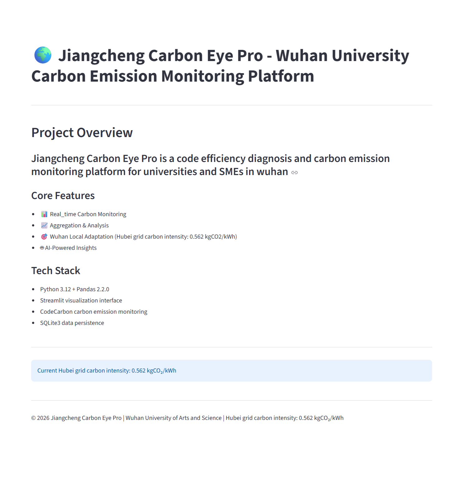
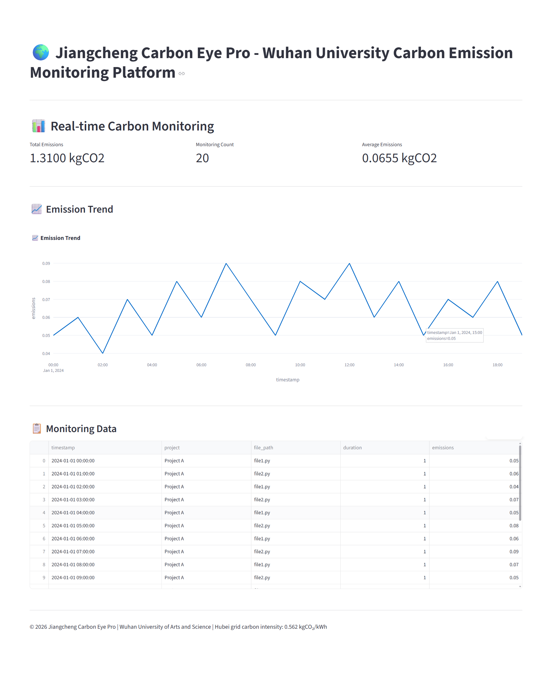
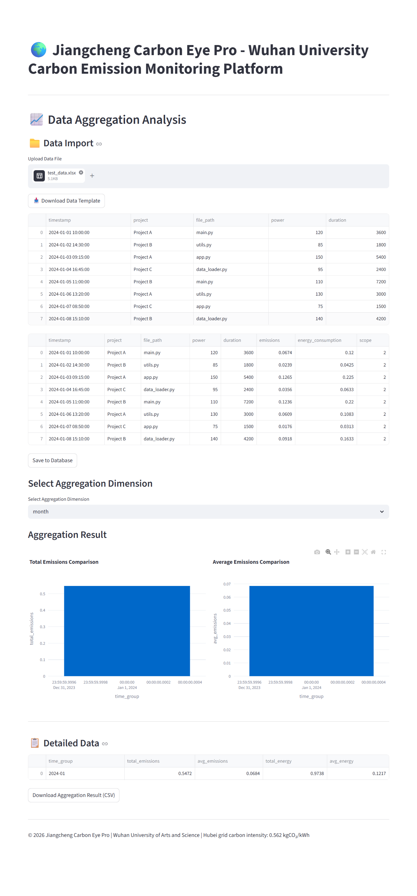
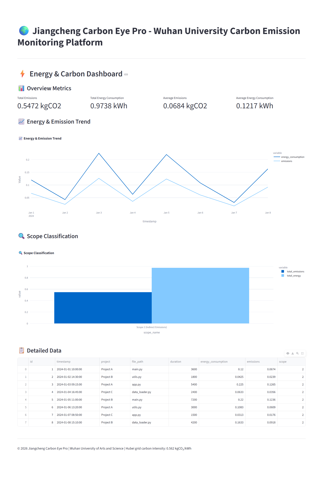
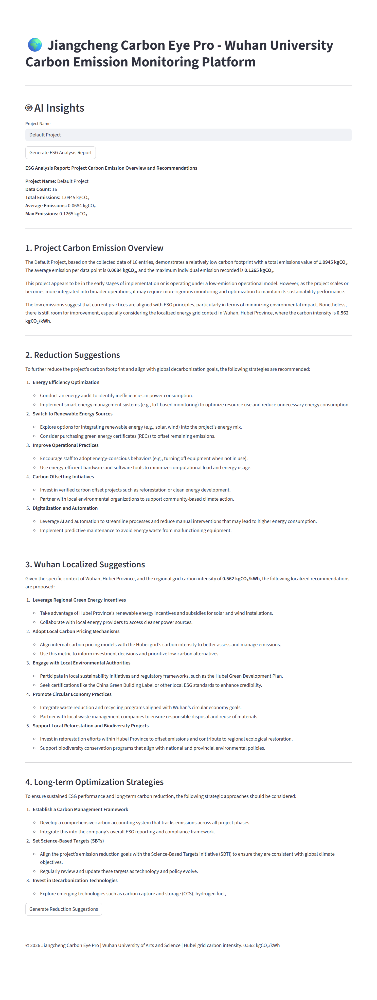

# 🌍 Jiangcheng Carbon Eye Pro

*"Making every line of code's carbon footprint visible, manageable, and reducible"*

A lightweight carbon emission monitoring platform for code efficiency diagnosis, specifically adapted for universities and SMEs in Wuhan, China. The platform deeply integrates Hubei grid carbon intensity (0.562 kgCO₂/kWh) to provide accurate data support for ESG reporting.

## ✨ Core Features

| Feature | Description | Technical Implementation |
|:---|:---|:---|
| 🔍 **Real-time Carbon Tracking** | Monitor real-time energy consumption and carbon emissions during code execution | CodeCarbon + Psutil real-time monitoring |
| 📊 **Multi-dimensional Aggregation** | Support project, file, time and other dimensions for data drilling | Pandas flexible aggregation, Plotly visualization |
| ⚡ **Energy & Carbon Dashboard** | Integrated energy consumption and carbon emission dual analysis | Streamlit responsive dashboard |
| 🌐 **Scope Classification** | Clearly display Scope 1/2/3 emission classification and proportions | Compliant with international carbon accounting standards |
| 🤖 **AI-Powered Insights** | Auto-generate ESG analysis reports and emission reduction suggestions | Tongyi Qianwen API integration |
| 🎯 **Wuhan Local Adaptation** | Default Hubei grid carbon intensity factor for accurate results | Configurable carbon intensity parameter |
| 🌍 **Multi-language Support** | Support Chinese/English interface switching | Internationalized configuration file |

## 📸 Interface Overview

| Home | Monitoring | Analysis |
|:---:|:---:|:---:|
|  |  |  |
| *Project Overview* | *Real-time Emission Monitoring* | *Data Aggregation Analysis* |

| Energy & Carbon Dashboard | AI Insights |
|:---:|:---:|
|  |  |
| *Energy & Carbon Dual Analysis* | *AI-Powered ESG Reports* |

## 🚀 5-Minute Quick Start

### Prerequisites

- Python 3.8+
- pip package manager

### One-click Install & Run

```bash
# 1. Clone the repository
git clone https://github.com/liuzhiming12/jiangcheng-carbon-eye.git
cd jiangcheng-carbon-eye

# 2. Install dependencies (recommended to use virtual environment)
pip install -r requirements.txt

# 3. Start the Carbon Eye Dashboard
streamlit run ui/app.py

# After startup, browser will automatically open http://localhost:8501
```

### API Configuration (Optional)

To use AI insights feature, set Tongyi Qianwen API key:

```bash
# Windows
set QWEN_API_KEY=your_api_key_here

# Linux/Mac
export QWEN_API_KEY=your_api_key_here
```

## 📁 Project Structure

```
jiangcheng_carbon_eye/
├── core/                          # Core business logic
│   ├── ai_insights.py             # AI insights module
│   ├── carbon_monitor.py          # Real-time carbon monitoring
│   ├── data_aggregator.py         # Data aggregation analysis
│   ├── database.py                # SQLite data persistence
│   └── emission_calculator.py     # Carbon emission calculation engine
├── ui/                            # User interface
│   ├── app.py                     # Streamlit main application
│   └── locales.py                 # Multi-language configuration
├── docs/                          # Documentation resources
│   └── images/                    # Interface screenshots
├── templates/                     # Data templates
│   └── data_template.xlsx         # Excel data import template
├── .gitignore                     # Git ignore configuration
├── LICENSE                        # MIT License
├── README.md                      # Project documentation
└── requirements.txt               # Python dependencies
```

## 🛠️ Tech Stack & Architecture

| Technology | Version | Selection Rationale |
|:---|:---|:---|
| **Python** | 3.12 | Rich ecosystem, ideal for rapid development of data analysis and AI applications |
| **Pandas** | 2.2.0 | Data processing gold standard, excellent performance, efficient aggregation operations |
| **Streamlit** | Latest | Rapidly build data dashboards, no frontend knowledge required, focus on business logic |
| **CodeCarbon** | Latest | Industry-recognized carbon emission monitoring library, ensures scientific data measurement |
| **Plotly** | Latest | Interactive visualization charts with zoom and hover data viewing |
| **SQLite** | - | Lightweight embedded database, no additional services required, simplified deployment |
| **DashScope** | Latest | Alibaba Cloud Tongyi Qianwen API, provides AI intelligent insight capabilities |

## 💡 Project Depth & Challenges

### Business Pain Points Solved

1. **Data Gap**: Local developers and SMEs in Wuhan lack awareness of runtime-level carbon emissions
2. **Tool Deficiency**: Market lacks lightweight monitoring tools adapted to Hubei grid carbon intensity
3. **Reporting Difficulty**: IT department energy consumption data in corporate ESG reports is often blank, requiring manual estimation

### Architecture Design Highlights

1. **Modular Design**: Calculation, aggregation, storage, and display layers are clearly separated for easy maintenance and expansion
2. **Fallback Strategy**: When CodeCarbon is unavailable, automatically falls back to Psutil estimation to ensure service availability
3. **Configuration-driven**: Carbon intensity, database path, etc. are all parameterized to adapt to different deployment environments
4. **Internationalization Support**: Complete Chinese/English switching to support international and local users

### Core Features Details

#### 1. Energy & Carbon Dashboard
Integrates energy consumption and carbon emission data, providing:
- Overview metrics (total emissions, total energy, averages)
- Energy consumption and carbon emission trend charts
- Scope classification proportions (Scope 1/2/3)

#### 2. AI-Powered Insights
Based on Tongyi Qianwen API to generate:
- ESG analysis reports
- Emission reduction suggestions
- Wuhan-localized suggestions

#### 3. Multi-dimensional Aggregation Analysis
Supports aggregation by project, file, time (hour/day/week/month/quarter/year), and scope

## 📊 Usage Examples

### Carbon Monitoring

```python
from core.carbon_monitor import monitor_emissions

def test_function():
    for i in range(1000000):
        x = i * i

result = monitor_emissions(
    code_to_run=test_function,
    project_name="Test Project",
    file_path="test.py"
)
```

### Data Aggregation

```python
from core.data_aggregator import aggregate_emissions

# Supported dimensions: project, file_path, hour, day, week, month, quarter, year, scope
result = aggregate_emissions(data, group_by="week")
```

### Carbon Emission Calculation

```python
from core.emission_calculator import calculate_emissions

# Parameters: power (W), duration (seconds), carbon intensity (kgCO2/kWh), scope
result = calculate_emissions(power_consumption=100, duration=3600)
```

### Data Persistence

```python
from core.database import CarbonDatabase

db = CarbonDatabase("carbon_data.db")
db.save_emission(project_name="Test", file_path="test.py", emissions=0.001)
```

- `get_trend.py`: Query daily emission trends from SQLite database

## 🌐 Localization

| Region | Carbon Intensity | Unit |
|--------|----------------|------|
| Wuhan / Hubei | 0.562 | kgCO₂/kWh |

The platform uses Hubei grid carbon intensity factor by default to ensure calculation results accurately reflect local actual conditions.

## 🌍 Multi-language Support

- **English**: For international users and technical documentation
- **简体中文**: For local users in Wuhan and surrounding areas

Simply use the language selector in the sidebar to switch - all UI elements, charts, and reports will update to the selected language.

## 📞 Contact & Support

- **Developer**: Liu Zhiming
- **Email**: liuzhiming_2005@qq.com
- **School**: Wuhan College of Arts and Sciences
- **Project Background**: Red Bird Challenge Camp Phase 3 - Sustainable Living Direction

## 📄 License

MIT License

---

*Made with ❤️ for Wuhan's carbon neutrality goals*

*Last updated: 2026/4/29*
